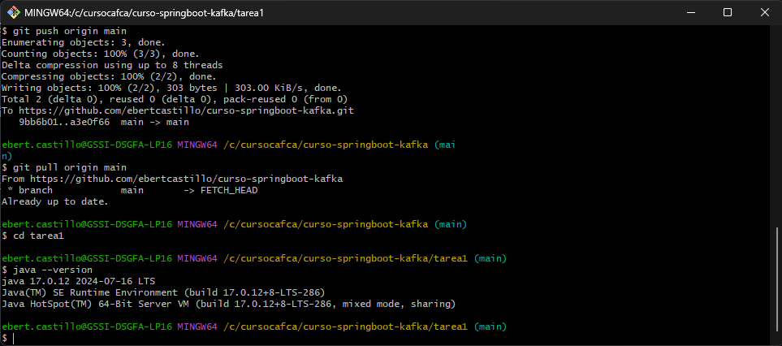
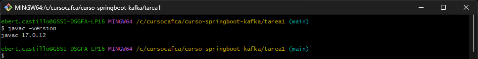
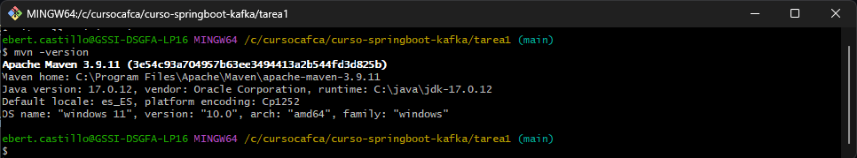
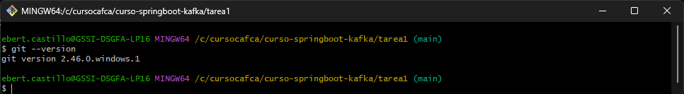
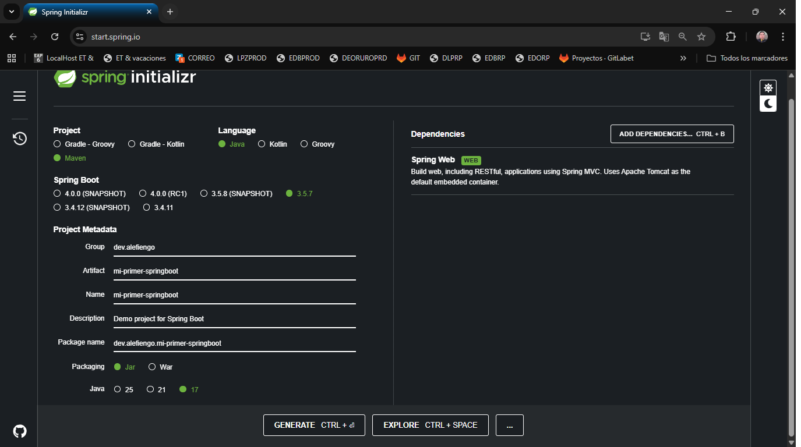
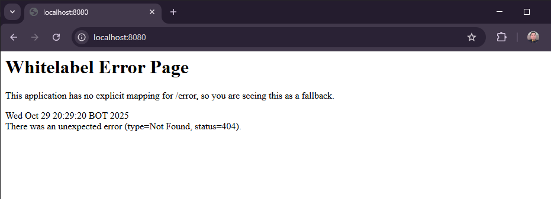

**Curso:** springboot-kafka

**Instructor:** Alejandro Fiengo

**Institución:** i-Quattro

**Nombre Completo:** Ebert Castillo Cortez

**TAREA 1**

**Objetivo**
Asegurar que tienes tu entorno de desarrollo completamente configurado y que comprendes la estructura de un proyecto Spring Boot, preparándote para empezar a programar en la Clase 2.

**Parte 1: Configuración del Entorno**

**Verificación**
Ejecuta estos comandos y captura los resultados:

java -version

javac -version

mvn -version

git --version

**Parte 2: Crear Proyecto Starter**

**VERIFICACION**

Método 1: Web (https://start.spring.io/)

Paso 2: Importa y ejecuta
*Descomprime (si usaste web)
*Abre en IntelliJ IDEA
*Espera que Maven descargue dependencias
*Ejecuta: mvn spring-boot:run

