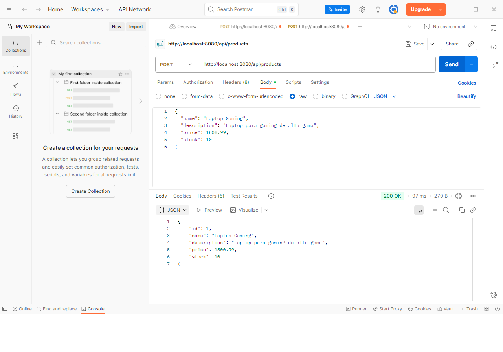

**Curso:** springboot-kafka

**Instructor:** Alejandro Fiengo

**Institución:** i-Quattro

**Nombre Completo:** Ebert Castillo Cortez

**TAREA 2 · CRUD básico de productos**

**Objetivo**
Construir un CRUD simple para la entidad Product utilizando Spring Data JPA, Docker Compose y pruebas con Postman, consolidando todo lo aprendido en la Clase 2.

**CREACION DEL PROYECTO**

**DOCUMENTOS JAVA**

**DOCUMENTOS DOCKER**

**EJECUCION DOCKER**

**EJECUCION PROYECTO-VERIFICACION**

**Requerimientos funcionales**

**POST /api/products crea un producto con los campos name, description, price, stock.**

**GET /api/products lista todos los productos y permite filtrar por nombre con ?name=.**

**GET /api/products/{id} devuelve un producto por su identificador.**

**PUT /api/products/{id} actualiza un producto existente (todos los campos).**

**DELETE /api/products/{id} elimina un producto.**

**INSERT POR CONSOLA**

**LOGS**

