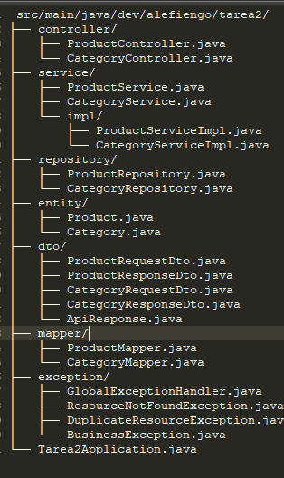
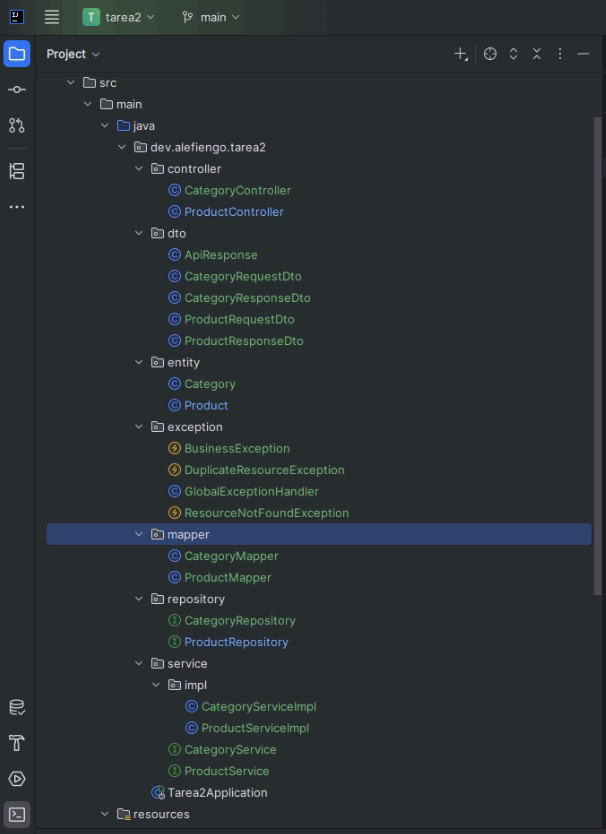
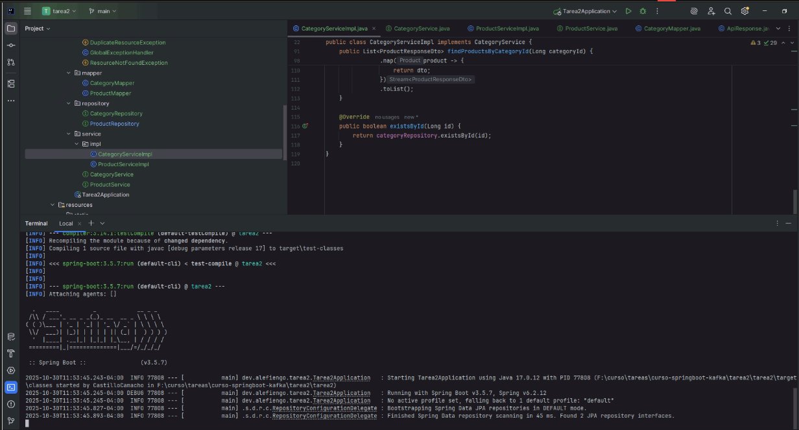
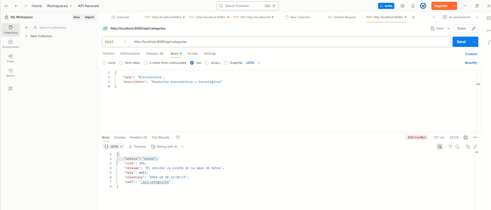
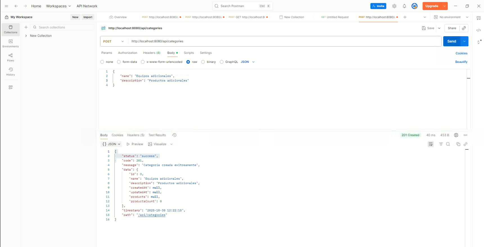
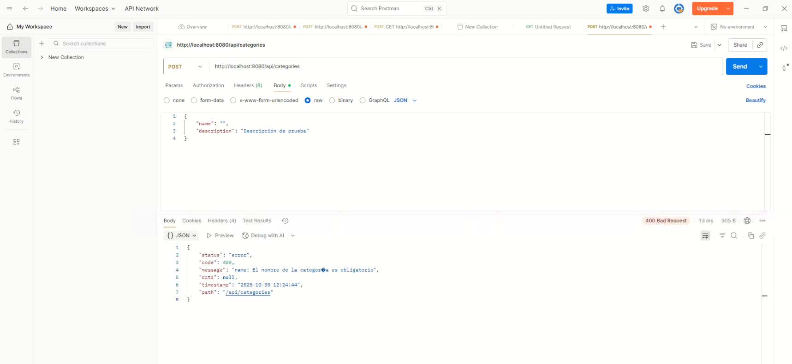

**Curso:** springboot-kafka

**Instructor:** Alejandro Fiengo

**Institución:** i-Quattro

**Nombre Completo:** Ebert Castillo Cortez

**TAREA 3 · Refuerzo de arquitectura, validaciones y relación 1:N**

**Objetivo**

Consolidar el product-service aplicando las buenas prácticas vistas en clase: capas bien definidas, DTOs validados, manejo uniforme de errores y categorías persistidas.

De acuerdo al proyecto realizado en la Tarea 2 se realizan los cambios correspondientes

**Arquitectura en capas completa**

Nueva arquitectura

**DTOs de producto y categoría con Bean Validation.**

Se inicia servicios de Docker y Sprinng

**Pruebas GET**

